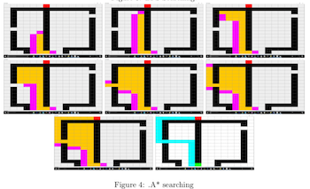

# Algo Analysis
Create and design a map, consisted of a goal, a starting
point and various obstacles, and then visually analyze different algorithms as they try to find the
best path from source to goal. For our first version, we have implemented four algorithms: Breadth
First Search, Depth First Search, A* and Hill Climbing.

- [Introduction](#introduction)
- [How to Use](#how-to-use)
- [Project Info](#goals)
- [Results](#result)





## Introduction

Algo-Analysis is a system which let user create and design a map, consisted of a goal, a starting
point and various obstacles, and then visually analyze different algorithms as they try to find the
best path from source to goal. For our first version, we have implemented four algorithms: Breadth
First Search, Depth First Search, A* and Hill Climbing.


## Questions

Is it easier to understand an algorithm by visual analysis? And is it possible to visually observe
the algorithms and come up with good conclusions? Are there any patterns of maps where each
algorithm performs better? Is it easier to see edge cases in visual analysis process? Which algo-
rithms performs better when only visually analyzed, and how does it compare to mathematical
analysis?

## Goals

Goal of this project is to analyze the performance of algorithms without using complex math and
logics, and to explain algorithms to students and people who are not familiar with it. Other goals
were to test if users, without any prior knowledge of the algorithms, could identify the optimality,
run time complexity and edge case possibilities for algorithms.

## Background

Algorithms are complex and hard to understand for many people. However, it’s been seen that
people understand a problem/solution better if they can visualize it, which can also be called
Visual thinking. Through some research, we found out that Visual Thinking is one of the best ways
to solve/explain/understand a problem. Many people prefer analyzing genetic and evolutionary
algorithms visually. Hence we used this visual thinking idea and implemented as Algo-Analysis
system to help students and people.

## Information

For this prototype, we are using only 4 algorithms. In which two algorithms A* and BFS always
give the optimal (assuming that heuristic function never produce larger value than actual value),
and one algorithm DFS may not be optimal where Hill Climbing could get stuck into local minima.
We modified the Hill Climbing algorithm so that it knows that which nodes has already been visited.

## Experiment

We created various maps and tested them with the implemented four algorithms. Maps included
the cases where source and goal were really close, source and goal were on different corner and
cases where no solutions were possible. Some maps included obstacles such that the currently
seems best path was blocked at the end which had interesting results. Following are some pictures
of the maps and AI’s trying to solve the map.


```
Figure 1: Hill Climbing Solving a simple map.
Figure 2: Smarter Map.
```
Second part of experiment included people who were not familiar with any algorithms (or
familiar with some of the algorithms). We let people make their own maps and asked them to
visually analyze the performance and let us know which algorithms they think is best. We asked
them if they can think of some edge cases where these algorithms might fail. And which algorithms
are finding the best optimal solutions.

### Result

In visual analysis, we found that BFS had to look through each nodes for almost every map. But
it performed well, and always found the best path. DFS didn’t look through as many nodes as
BFS, but it couldn’t find the optimal solutions in most cases. Hill climbing was easily stuck in
most maps, and didn’t perform as well as other algorithms.
People were able to find the pattern quickly. In beginning, everyone tried a simple map but
soon they tried to trap the AI with complex and smart maps. They observed quickly that DFS
didn’t find the best path, BFS finds the best path but looks over all the nodes, Hill Climbing goes
for the best neighbor and sometimes get stuck (local minima), and A* was performing really well.
Not only it found the optimal path, it also looked through the least amount of nodes. After seeing
some examples, people started thinking about the edge cases like what if there is no map and what
if the a path is really close to the source but blocked at the end.

### Analysis

Visual analysis almost matched with the actual mathematical analysis. Result of algorithms’ per-
formances was as expected, however people’s behavior and learning curve was impressive. We
intentionally made Hill Climbing weak, and let people decide how to we improve it. Some sug-
gested to keep track of the nodes visited, some suggested to take random path when stuck (sounded
like simulated annealing).
We also found some patterns in performances of algorithms. There was no best algorithms,
but every algorithm has its weakness and strength. For one example, If a source is close to goal
then BFS worked really well, but when source is away from the goal then DFS looked through
less nodes. Visual observation indicated that A* performed best, BFS always worked but explored
almost entire map, DFS was fast in some cases but failed to find shortest path and Hill Climbing
could perform better with some randomness. (see visual section)


```
Figure 3: BFS Searching
```


```
Figure 4: A* searching
```


```
Figure 5: DFS Searching
```

### Conclusion

At the end, we concluded that our experiment and project was successful. It seems visual analysis
matches (a lot) with mathematical analysis. One weakness of visual analysis is in close comparisons
or solid logical arguments and result fluctuates with the inputs. However it did help us conclude
that visual analysis helped people to understand algorithms better. When we explained BFS before
the experiment, people seemed troubled but after the experiment, people seemed to understand
it better. So our project was a success since we answered our questions and we came up with a
prototype which could help future students with their studies of algorithms.

### How To Use

This project is written in Java with NetBeans. Run Algo-Analysis/src/algo/analysis/AlgoAnalysis.java to start the GUI, now follow following.

There are 4 stage in the program. 

```
- First stage, you select the size of the grid, select which algorithm you want to test, select whether you want to
allow diagonal movements or not. 
- Second stage is instruction window. 
- Third is where you create your map. Click on the edit mode (like set Source, set Goal, set Obstacles) and then click play.
- In fourth stage, you can control the speed of the visual analysis but using a slider in down right
corner. 
```
Followings are the color codes.

```
- Red: Goal
- Green: Source
- Black: Obstacles
- Magenta:seen but yet to visit
- Orange: visited
- Blue: Current Node
- Cyan:Best Path
- Dark Grey: No Solution
```
## References

- Handbook of Research on Teaching Literacy through the Communicative and Visual Arts.
    Ed. James Flood, Shirley Brice Heath, and Diane Lapp. 1997, Macmillan Library Reference
- M. Lotif and A. L. V. Coelho, "Visually inspecting the search behavior of Harmony Search
    and its variants with Viz3D," 2011 IEEE Congress of Evolutionary Computation (CEC),
    New Orleans, LA, 2011, pp. 616-623.
- Llorà, Xavier, Kumara Sastry, Francesc Alías, David E. Goldberg, and Michael Welge. "An-
    alyzing Active Interactive Genetic Algorithms Using Visual Analytics." Proceedings of the
    8th Annual Conference on Genetic and Evolutionary Computation - GECCO ’06(2006): n.
    pag. Web.
- Renukamurthy, Sanjay. "Improving Spatially Distributed Multiagent Path Nding Using Co-
    operative JPS." N.p., n.d. Web.
- Nelsen, Roger B. "Proofs Without Words." Google Books. N.p., n.d. Web. 13 Dec. 2016.
- Jacobson, Sheldon H., and Enver YÃ^14 cesan. "Analyzing the Performance of Generalized Hill
    Climbing Algorithms." Journal of Heuristics 10.4 (2004): 387-405. Web.


